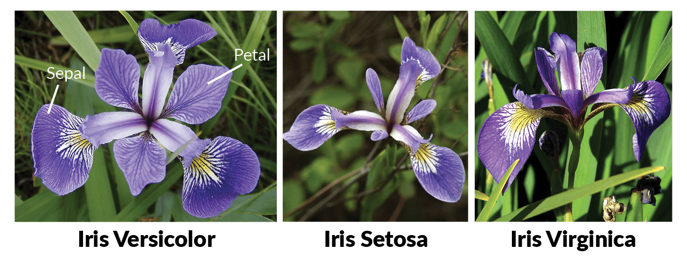

The Iris flower data set is a multivariate data set introduced by the British statistician and biologist Ronald Fisher in his 1936 paper "The use of multiple measurements in taxonomic problems as an example of linear discriminant analysis." The dataset contains four features (length and width of sepals and petals) of 50 samples of three species of Iris (Iris setosa, Iris virginica, and Iris versicolor). These measures were used to create a linear discriminant model to classify the species.

In this project, I practiced some data visualization techniques on the Iris dataset with R by performing frequency analysis, density analysis, histogram, scatterplot, and correlation box plot.



---

## Import the required packages and import Iris dataset

```{r}

library(ggplot2)
library(readr)
library(gridExtra)
library(grid)
library(plyr)

iris=read.csv('./Iris.csv')

iris[sample(nrow(iris),20),]

```

## Frequency analysis with Histogram

```{r}

# For Sepal length (cm)

HisSl <- ggplot(data=iris, aes(x=SepalLengthCm))+
  geom_histogram(binwidth=0.2, color="black", aes(fill=Species)) + 
  xlab("Sepal Length (cm)") +
  ylab("Frequency") +
  theme(legend.position="none")+
  ggtitle("Histogram of Sepal Length")+
  geom_vline(data=iris, aes(xintercept = mean(SepalLengthCm)),linetype="dashed",color="grey")

# For Sepal width (cm)

HistSw <- ggplot(data=iris, aes(x=SepalWidthCm)) +
  geom_histogram(binwidth=0.2, color="black", aes(fill=Species)) + 
  xlab("Sepal Width (cm)") +  
  ylab("Frequency") +
  theme(legend.position="none")+
  ggtitle("Histogram of Sepal Width")+
  geom_vline(data=iris, aes(xintercept = mean(SepalWidthCm)),linetype="dashed",color="grey")

# For Petal length (cm)

HistPl <- ggplot(data=iris, aes(x=PetalLengthCm))+
  geom_histogram(binwidth=0.2, color="black", aes(fill=Species)) + 
  xlab("Petal Length (cm)") +  
  ylab("Frequency") +
  theme(legend.position="none")+
  ggtitle("Histogram of Petal Length")+
  geom_vline(data=iris, aes(xintercept = mean(PetalLengthCm)),
             linetype="dashed",color="grey")

# For Petal width (cm)

HistPw <- ggplot(data=iris, aes(x=PetalWidthCm))+
  geom_histogram(binwidth=0.2, color="black", aes(fill=Species)) + 
  xlab("Petal Width (cm)") +  
  ylab("Frequency") + 
  theme(legend.position="right" )+
  ggtitle("Histogram of Petal Width")+
  geom_vline(data=iris, aes(xintercept = mean(PetalWidthCm)),linetype="dashed",color="grey")


# Plot all visualizations in a grid

grid.arrange(HisSl + ggtitle(""),
             HistSw + ggtitle(""),
             HistPl + ggtitle(""),
             HistPw + ggtitle(""),
             nrow = 2,
             top = textGrob("Iris Frequency Histogram", gp=gpar(fontsize=14))
)

```

## Density analysis with Histogram

```{r}

DhistPl <- ggplot(iris, aes(x=PetalLengthCm, colour=Species, fill=Species)) +
  geom_density(alpha=.3) +
  geom_vline(aes(xintercept=mean(PetalLengthCm),  colour=Species),linetype="dashed",color="grey", size=1)+
  xlab("Petal Length (cm)") +  
  ylab("Density")+
  theme(legend.position="none")

DhistPw <- ggplot(iris, aes(x=PetalWidthCm, colour=Species, fill=Species)) +
  geom_density(alpha=.3) +
  geom_vline(aes(xintercept=mean(PetalWidthCm),  colour=Species),linetype="dashed",color="grey", size=1)+
  xlab("Petal Width (cm)") +  
  ylab("Density")

DhistSw <- ggplot(iris, aes(x=SepalWidthCm, colour=Species, fill=Species)) +
  geom_density(alpha=.3) +
  geom_vline(aes(xintercept=mean(SepalWidthCm),  colour=Species), linetype="dashed",color="grey", size=1)+
  xlab("Sepal Width (cm)") +  
  ylab("Density")+
  theme(legend.position="none")

DhistSl <- ggplot(iris, aes(x=SepalLengthCm, colour=Species, fill=Species)) +
  geom_density(alpha=.3) +
  geom_vline(aes(xintercept=mean(SepalLengthCm),  colour=Species),linetype="dashed", color="grey", size=1)+
  xlab("Sepal Length (cm)") +  
  ylab("Density")+
  theme(legend.position="none")

grid.arrange(DhistSl + ggtitle(""),
             DhistSw + ggtitle(""),
             DhistPl + ggtitle(""),
             DhistPw + ggtitle(""),
             nrow = 2,
             top = textGrob("Iris Density Histogram", gp=gpar(fontsize=14))
)

```

## Sepal and Petal Box Plot

```{r}

BpSl <- ggplot(iris, aes(Species, SepalLengthCm, fill=Species)) + 
        geom_boxplot()+
        scale_y_continuous("Sepal Length (cm)", breaks= seq(0,30, by=.5))+
        theme(legend.position="none")


BpSw <- ggplot(iris, aes(Species, SepalWidthCm, fill=Species)) + 
        geom_boxplot()+
        scale_y_continuous("Sepal Width (cm)", breaks= seq(0,30, by=.5))+
        theme(legend.position="none")


BpPl <- ggplot(iris, aes(Species, PetalLengthCm, fill=Species)) + 
        geom_boxplot()+
        scale_y_continuous("Petal Length (cm)", breaks= seq(0,30, by=.5))+
        theme(legend.position="none")


BpPw <- ggplot(iris, aes(Species, PetalWidthCm, fill=Species)) + 
        geom_boxplot()+
        scale_y_continuous("Petal Width (cm)", breaks= seq(0,30, by=.5))+
        labs(title = "Iris Box Plot", x = "Species")

grid.arrange(BpSl + ggtitle(""),
             BpSw + ggtitle(""),
             BpPl + ggtitle(""),
             BpPw + ggtitle(""),
             nrow = 2,
             top = textGrob("Iris Sepal and Petal Box Plot", 
                            gp=gpar(fontsize=14))
)
```

## Petal Length vs Width Scatterplot

```{r}

ggplot(data = iris, aes(x = PetalLengthCm, y = PetalWidthCm))+
  xlab("Petal Length")+
  ylab("Petal Width") +
  geom_point(aes(color = Species,shape=Species))+
  geom_smooth(method='lm')+
  ggtitle("Iris Petal Length vs Width")
```

## Sepal Length vs Width

```{r}

ggplot(data=iris, aes(x = SepalLengthCm, y = SepalWidthCm)) +
  xlab("Sepal Length") + 
  ylab("Sepal Width") +
  geom_point(aes(color=Species, shape=Species)) +
  geom_smooth(method='lm')+
  ggtitle("Iris Sepal Length vs Width")
```

## Correlation Box Plot

```{r}

library(GGally)
ggpairs(data = iris[1:4],
        title = "Iris Correlation Plot",
        upper = list(continuous = wrap("cor", size = 5)), 
        lower = list(continuous = "smooth")
)
```

